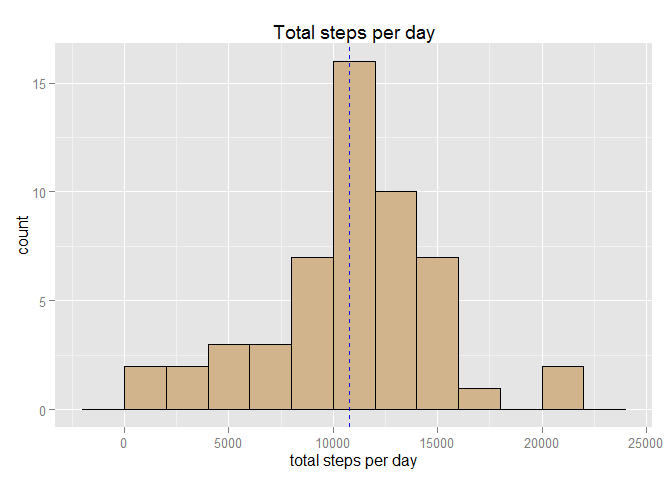
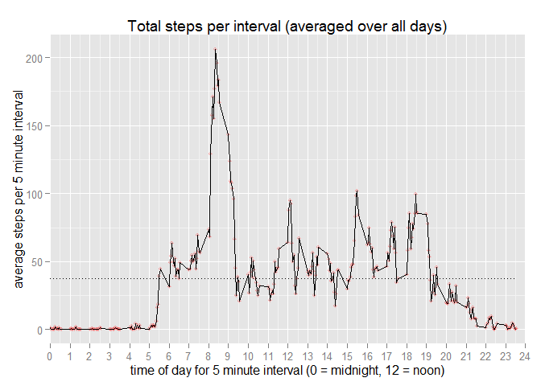
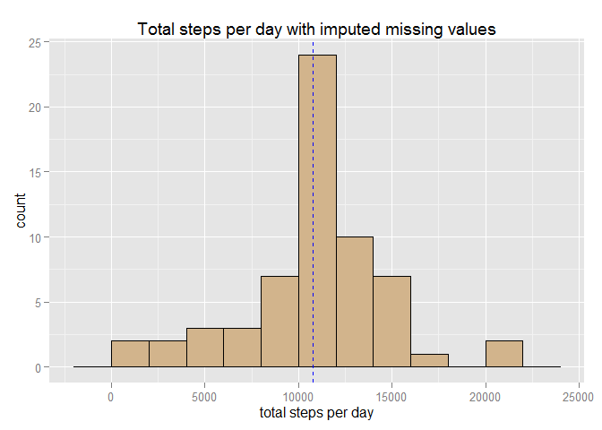
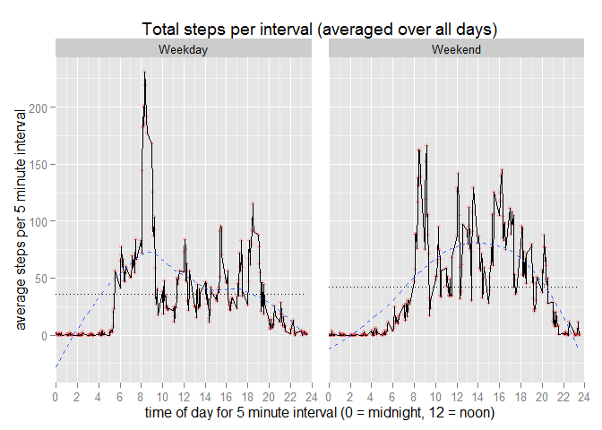

# Reproducible Research: Peer Assessment 1


## Loading and preprocessing the data
The data for this project consists of a comma delimited data file (*activity.csv*)
the contains three fields:

  * steps -  the number of steps taken in a 5 minute period
  * date  -  the day of the measurements
  * interval - the time of day where 0 is the start of the day (midnight)
    and 1200 is noon.
    

```r
# Load libraries required for this exercise.  Suppress warnings during loading
library(ggplot2)
library(grid) # for theme in ggplot2

# read the data with the header.  Turn off stringsAsFactors to avoid issues with the date
df1 <- read.csv("activity.csv", header=TRUE, stringsAsFactors = FALSE)

# Convert the string date field (i.e. 2014-02-05) to a date object for processing
# Also divide the interval by 100 to get a representation in hours (i.e. 1000 = 10AM)
df2 <- transform(df1, date = as.Date(df1$date), hour = df1$interval / 100)       
```


## What is the mean total number of steps taken per day?


```r
# Aggregate based on date and sum all values for each date to get total steps
df3 <- aggregate(steps ~ date, data = df2, sum) # This removes NA values for us

# Find the average of the total number of steps per day (rounded to nearest whole number)
avg <- format(mean(df3$steps), digits = 1)
# Find the median of the total number of steps per day (rounded to nearest whole number)
med <- format(median(df3$steps), digits = 1)

# Plot a histogram of the total steps per day
ggplot(df3, aes(x = steps)) + 
    geom_histogram(colour = "black", fill = "tan", binwidth = 2000) +
    geom_vline(xintercept = mean(df3$steps), colour = "blue", linetype = "dashed") +
    xlab("total steps per day") + 
    ggtitle("Total steps per day")
```

 

The **mean** steps/day value (shown as a dashed line) is 10766.

The **median** steps/day value is 10765.


## What is the average daily activity pattern?


```r
# First aggregate by interval over all days and find the mean of each interval
df4 <- aggregate(steps ~ interval * hour, data = df2, mean)

maxIdx <- which.max(df4$steps) # Where is the maximum number of steps (index)
maxInterval <- df4$interval[maxIdx] # What is the interval for that value
maxHour <- df4$hour[maxIdx] # what is the hour for that value

# Now plot the average daily activity by hour of the day.  Include line graph
# and the data points to give an idea where the data actually is on the lines.
ggplot(df4, aes(x = hour, y = steps)) + 
    geom_point(shape = 10, colour = "red", size = 1.3, alpha = .2) +
    geom_line() + 
    geom_line(stat="hline", yintercept="mean", linetype="dotted") +
    coord_cartesian(xlim=c(0,24)) +
    scale_x_continuous( breaks=c(0:24)) +
    ylab("average steps per 5 minute interval") + 
    xlab("time of day (0 = midnight, 12 = noon)") + 
    ggtitle("Total steps per interval (averaged over all days)")
```

 

It makes sense that midnight to 5:30AM have few steps as that is a normal sleep period
that should not involve many steps.  The same is probably true for the late night
period where steps are low.

The **maximum** number of steps is taken at hour 8.35 (interval 835)
during the day.

The average steps per five minute interval is shown as a dashed line for reference.


## Imputing missing values

```r
missing = is.na(df2$steps) # steps is only column with missing values
numMissing = sum(missing)

##################
# IMPUTE STRATEGY: 
##################
#   Replace any missing value of steps with the average for that interval
#   Note that df4 from above contains the average steps per interval values we need
df2$imputedSteps = df2$steps
for (i in 1:length(df2$imputedSteps)) {
   if ( is.na(df2$imputedSteps[i])) { # If this value is NA, replace it
       idx = which(df4$interval == df2$interval[i]) # Find interval in df5
       ###print(paste(df5$interval[idx],df2$interval[i])) # Diagnostic
       df2$imputedSteps[i] = df4$steps[idx] # Replace with average for this interval
   }
}

###sum(is.na(df2$imputedSteps)) # This returns zero as expected

# Aggregate based on date and sum all values for each date to get total steps
idf <- aggregate(imputedSteps ~ date, data = df2, sum)

# Find the average of the total number of steps per day (rounded to nearest whole number)
impAvg <- format(mean(idf$imputedSteps), digits = 1)
# Find the median of the total number of steps per day (rounded to nearest whole number)
impMed <- format(median(idf$imputedSteps), digits = 1)

# Plot a histogram of the total steps per day
ggplot(idf, aes(x = imputedSteps)) + 
    geom_histogram(colour = "black", fill = "tan", binwidth = 2000) +
    geom_vline(xintercept = mean(idf$imputedSteps), colour = "blue", linetype = "dashed") +
    xlab("total steps per day") + 
    ggtitle("Total steps per day with imputed missing values")
```

 

There are 2304 **missing values** for number of steps in the original data.

After replacing missing values with the average value for the time interval:

  + The **mean** steps/day value (shown as a dashed line) is 10766 (without imputed data - 10766).
  + The **median** steps/day value is 10766 (without imputed data - 10765).

There is *no significant difference* between the original data and the data with
imputed values for missing steps.  This is true for a bin size of 1000 and a bin size
of 2000 (shown).


## Are there differences in activity patterns between weekdays and weekends?


```r
df2$dayType = weekdays(df2$date)
for (i in 1:length(df2$dayType)) {
   if ( df2$dayType[i] == "Saturday" || df2$dayType[i] == "Sunday" ) {
       df2$dayType[i] = "Weekend" # Saturday or Sunday is a weekend
   } else {
       df2$dayType[i] = "Weekday" # All others are weekday
   }
}

df6 <- aggregate(imputedSteps ~ interval * dayType, data = df2, mean)
# Divide the interval by 100 so that the resulting value can be used as hour of the day
df7 <- transform(df6, hour = interval / 100)

# Now plot the average daily activity by hour of the day.  Include line graph
# and the data points to give an idea where the data actually is on the lines.
ggplot(df7, aes(x = hour, y = imputedSteps)) + 
    geom_point(shape = 10, colour = "red", size = 1.3, alpha = .2) +
    geom_line() + 
    geom_smooth(method="loess", linetype="dashed", se=FALSE) +
    geom_line(stat="hline", yintercept="mean", linetype="dotted") +
    coord_cartesian(xlim=c(0,24)) +
    scale_x_continuous( breaks=seq(0,24,by = 2)) +
    ylab("average steps per 5 minute interval") + 
    xlab("time of day (0 = midnight, 12 = noon)") + 
    ggtitle("Total steps per interval (averaged over all days)") + 
    facet_grid( . ~ dayType) +
    theme(panel.margin = unit(1, "lines"))
```

 

It appears that weekends have a slightly higher number of steps per day (horizontal lines
show average steps per interval for weekend is slightly higher than for weekday).

The number of steps per interval seems more evenly distributed on the weekend while the
weekdays have a lot of steps during the morning (6-10 AM) and fewer during the day.
